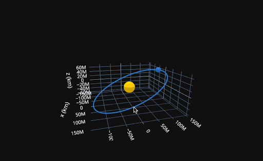

# Solar Eclipses Python Lesson



Educational Python Material for the April 8th, 2024 Solar Eclipse 🌑✨ - Suitable for Grades 8-12

Dive into the celestial mechanics of solar eclipses with our comprehensive educational lesson, timed for the upcoming April 4th, 2024, solar eclipse visible in the US. This repository contains engaging and informative resources for middle and high school students (grades 8-12).

## What's Inside?

- **Marp & PowerPoint Slides**: Discover easy-to-understand slides that break down the science behind solar eclipses. From the basics of shadow casting by the Moon to the intricate dance of celestial bodies, these slides are designed to enlighten and engage.
- **Jupyter Notebook Lesson**: Embark on an interactive journey through our meticulously crafted Python Jupyter notebook. It features lessons with 2D and 3D interactive models of the Moon's and Earth's orbits. Students can explore these models hands-on, enhancing their understanding of how these celestial movements lead to the awe-inspiring phenomenon of solar eclipses.
- **Speaker Notes**: We've included detailed speaker notes for both the notebook and slides to support educators. These notes provide valuable insights, making it easier to convey complex concepts in a classroom setting.

Our resources are crafted to spark curiosity and deepen understanding of solar eclipses through interactive learning and exploration. Perfect for classroom use or individual study, this material is your go-to for an astronomical event to be noticed.

Let's make learning about the April 4th, 2024, solar eclipse an unforgettable educational adventure!"

## Getting Started With Grader Than:

You can follow these steps to give your students all the content in their Grader Than Workspace.

**Prerequisites:** A [Grader Than Workspace setup](https://docs.graderthan.com/workspace/create/) is required.

1. Create a `Solar Eclipse Course Content` dependency. Please take a look at these [instructions](https://docs.graderthan.com/workspace/config/#create-a-dependency) for guidance on setting up a dependency.
2. Use the following script as your install guide for the `Solar Eclipse Course Content` dependency you just created:

   <details>
   <summary>Click to show dependency script</summary>

   ```shell
    #!/bin/bash

    # Installs an extension that allows you to view marp slide in your workspace
    gt_extension_installer install marp-team.marp-vscode &

    # Updates the marp settings to enable HTML usage
    jq '. + {"markdown.marp.enableHtml": true}' /home/developer/.ide/data/User/settings.json | sponge /home/developer/.ide/data/User/settings.json

    # Clones the solar eclipse content in the workspace code dir
    cd "/home/developer/Documents/code/"
    GIT_REPO_URL=https://github.com/graderthan/solar-eclipses-2024.git
    
    repo_name=$(basename -- "${GIT_REPO_URL}")
    repo_name="${repo_name%.*}"
    
    if [ -d "./$repo_name" ]; then
      # The local repo exists.
      cd "./$repo_name"
      # Save student's local changes
      git stash save
      # Get the latest content
      git pull -X ours
      # Overwrite conflicting new changes with the student's saved changes 
      git stash pop
      git checkout --theirs .
      git add .
    else
      # The local repo does not exist b/c it's the first time.
      git clone "${GIT_REPO_URL}"
    fi
    
    wait
    
    # If anything goes wrong, don't prevent the workspace from starting.
    exit 0
   ```

   </details>

3. **🥳 Completion!** Your students and course now have access to the course content.

## Need Glasses 😎?

Please [get in touch with us](https://portal.graderthan.com/contact-us/) if your course needs solar eclipse viewing glasses.

We believe that learning to code should be fun, interactive, and accessible. With these resources, we hope to ignite a passion for programming in your students and equip them with the skills to explore the vast universe of coding.

Happy teaching! 🍎💻🌈
