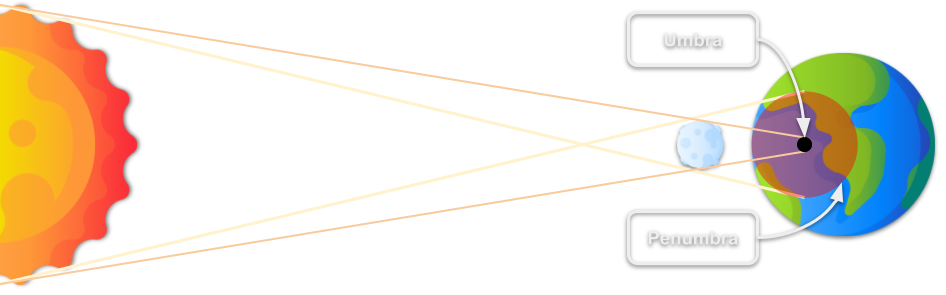
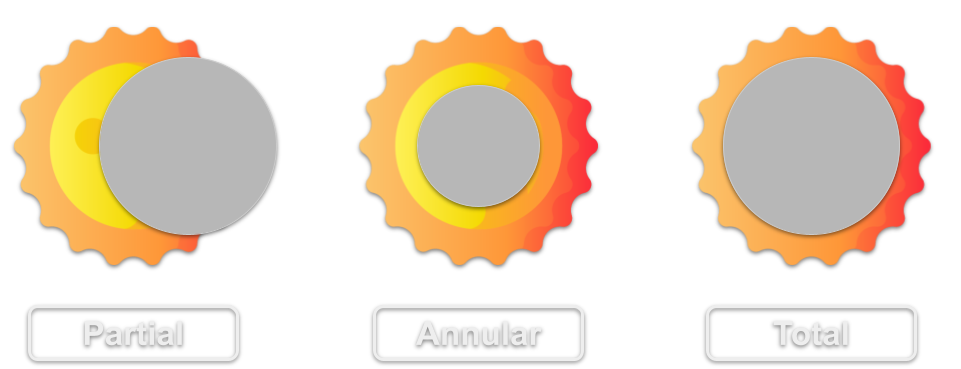

<!-- _backgroundColor: #000000 -->

    
    Image by Luc Viatour

# Solar Eclipse 
**April 8th**

<!-- 
- A solar eclipse happens when the Moon moves between the Sun and Earth, creating a shadow on Earth.
- Solar eclipses are rare. The last total eclipse in America was in 2017.
- At least two solar eclipses occur each year somewhere on Earth.
- Total eclipses happen only during a new moon, about once every 1-2 years.
-->

---
<!-- _footer: "" -->

## What is an eclipse?

- A person in the dark area, known as the *Umbra*, sees a total eclipse.
- Individuals in the *Penumbra*, the lighter shadow, will witness a partial eclipse.

<!-- 
- A solar eclipse occurs when the Moon passes between the Sun and the Earth, casting its shadow on Earth.
- This event happens during the new moon phase, when the Moon's dark side faces Earth.
- Total solar eclipses, where the Sun and Moon appear the same size in the sky, are a special kind of eclipse.
- Typically, Earth experiences two solar eclipses each year, but total eclipses are rarer.
- As the Moon slowly drifts away from Earth, total solar eclipses will become even rarer and eventually cease.
-->

---
<!-- _footer: "" -->

## Types of Eclipse

 - **Partial:** The Moon partially covers the Sun.
 - **Annular:** The Moon leaves a ring of sun visible.
 - **Total:** The Moon completely covers the Sun

<!-- 
- This slide showcases the three main types of solar eclipses: partial, annular, and total.
- In a partial eclipse, the Moon only covers a part of the Sun, leading to a partial shadow on Earth.
- An annular eclipse occurs when the Moon is directly in front of the Sun but doesn't completely cover it, creating a "ring of fire" appearance. 
- Annular eclipse happens when the moon's orbit is further from the earth so the moon appears smaller from perspective of an observe on earth.
- During a total eclipse, the Moon fully covers the Sun, plunging a specific area on Earth into darkness.
-->

---
<!-- _backgroundColor: #141414 -->

    
    Image by NASA's Scientific Visualization Studio

<!-- 
- The image shows the path of the eclipse across America on April 8th, 2024.
- The dark, thicker line represents the umbra, where viewers will see a total eclipse.
- The thinner lines illustrate the penumbra, indicating areas that will experience a partial eclipse.
-->
